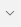

# Testing QoD API with Postman

## Prerequisites

- Install Postman (Version 9.25.2) application in your system. Click on the **e-support** link to raise an IT service request for the installation of Postman.
- Ensure you are connected to VPN.

## Post a Session
The user must follow the below procedure to create a new session from the local system.
1. Open the **Postman** application and log in with the necessary credentials.
2. Click  symbol available in the workspace to open a new tab.
3. Click  symbol and select the **Post** request type.
4. Provide the **URL** [http://172.16.10.198:8080/sessions](http://172.16.10.198:8080/sessions) in the **Enter request URL** field.
5. Click the **Body** tab and select **raw** radio button. Also select **JSON** from the drop down list and provide the following code details.  
   ```bash
      {
       "duration": 86400,
        "device": {
        "ipv4Address": {
           "publicAddress": "10.0.0.3"
         }
      },
     "applicationServer": {
         "ipv4Address": "10.0.0.3"
         },
     "qosProfile": 9,
    "webhook": {
       "notificationUrl": "https://application-server.com",
       "notificationAuthToken": "c8974e592c2fa383d4a3960714"
        }
      }
    ```
6. Click **Send** button to initiate the request.
7. The following JSON data is displayed in the response body.
    ```bash
        {
        "duration": 86400,
        "device": {
            "phoneNumber": null,
            "networkAccessIdentifier": null,
            "ipv4Address": {
                "publicAddress": "10.0.0.3",
                "publicPort": 0
            },
            "ipv6Address": null
        },
        "applicationServer": {
            "ipv4Address": "10.0.0.3",
            "ipv6Address": "::3"
        },
        "devicePorts": null,
        "applicationServerPorts": null,
        "qosProfile": "9",
        "webhook": {
            "notificationUrl": "https://application-server.com",
            "notificationAuthToken": null
        },
        "sessionId": "64f5a18a391cf88e132291e9",
        "startedAt": 0,
        "expiresAt": 0,
        "qosStatus": null,
        "messages": null
        }
    ```  
## Get a Session  

1. Open the **Postman** application.
2. Click  symbol available in the workspace to open a new tab.
3. Click  symbol and select the **Get** request type.
4. Provide the **URL** [http://172.16.10.198:8080/sessions/{sessionId}](http://172.16.10.198:8080/sessions/{sessionId}) in the **Enter request URL** field.

::: tip Note

- The user can get the session id from the response body during the creation of post session from the **sessionId** parameter.
- The request body is empty during the creation of **Get** session.

:::

5. Click **Send** button to initiate the request.
6. The following code details are displayed in the response body.

```bash
{
   "duration": 86400,
    "device": {
        "phoneNumber": null,
        "networkAccessIdentifier": null,
        "ipv4Address": {
            "publicAddress": "10.0.0.3",
            "publicPort": 0
        },
        "ipv6Address": null
    },
    "applicationServer": {
        "ipv4Address": "10.0.0.3",
        "ipv6Address": "::3"
    },
    "devicePorts": null,
    "applicationServerPorts": null,
    "qosProfile": "9",
    "webhook": {
        "notificationUrl": "https://application-server.com",
        "notificationAuthToken": null
    },
    "sessionId": "64f5a18a391cf88e132291e9",
    "startedAt": 0,
    "expiresAt": 0,
    "qosStatus": null,
    "messages": null
}
```  
## View a session on NEF Emulator
The user must follow the below procedure to view a created session on NEF Emulator.

:::tip Note

Ensure you are connected to the VPN with gateway as **gateway1.comviva.com**.

:::

1. Open the [NEF Emulator](http://172.16.10.101:8090/) web application in any browser and provide the below credentials to log in to the application.
    - UserName: admin@my-email.com
    - Password: pass
2. Navigate to the **API tools** > **Swagger UI** > **Northbound APIs** available on the left pane of the NEF Emulator application. It will redirect you from the NEF Emulator to the **Swagger documentation** page.
3. The user must follow the below procedure to access and execute APIs:   
    a. Click **Authorize**, available on the **Swagger documentation** page.  
    b. Provide the following credentials in the **Available authorizations** pop up window:
        - username: admin@my-email.com
        - password: pass

    c. Click **Authorize** to execute NEF swagger APIs.  
    e. Navigate to **Session With QoS API** and expand the **GET** session.  
    f. Click **Try it out** button available in the **Parameters** field to get the subscription by Id.  
    g. Type **admin** in the **Description** field.  
    h. Click **Execute** button to view the **Curl**, **Request URL**, and **Server** responses.